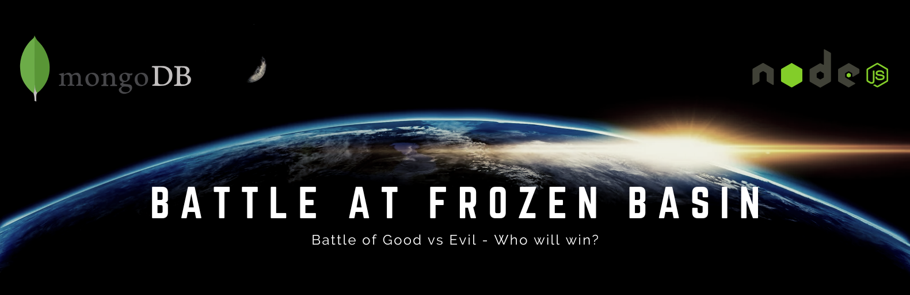

# WebGL Globe


---

## Github Version:
> ##### Runs static html assets only

[https://galactic-plane.github.io/webgl-globe/wwwroot/index.html](https://galactic-plane.github.io/webgl-globe/wwwroot/index.html)

## Heroku Version:
> ##### Runs via node.js/express served up on heroku and stores stats via mongo atlas

[https://frozen-basin-22700.herokuapp.com/](https://frozen-basin-22700.herokuapp.com/)



## Learn More:
> ##### Detailed information on how globe was made 

[https://penrodtech.wixsite.com/blog/post/webgl-globe-bezier-curves-and-particle-effects](https://penrodtech.wixsite.com/blog/post/webgl-globe-bezier-curves-and-particle-effects)

WebGL Globe is a cloud-enabled (via the cloud bump map :P), mobile-ready (if you want), earth powered HTML5/THREE.JS app.

  - jQuery
  - three.js
  - HTML5
  - Materialize-CSS

## Clone
Use [git](https://git-scm.com/downloads) to install webgl-globe.

```bash
$ git clone https://github.com/galactic-plane/webgl-globe.git
```
## Install
In the webgl-globe directory run:
```bash
$ npm install
```
## Run Local 
[Node.js](https://nodejs.org/en/download/) :zap: [Express](https://expressjs.com/en/starter/installing.html) :zap: [Nodemon](https://www.npmjs.com/package/nodemon)
```bash
$ nodemon app.js localhost 3000
```
## Usage

```javascript
let container = document.getElementById('globe');
let globeObj = new DAT.Globe(container);
// random line color
let color = new THREE.Color(0xffffff);
color.setHex(Math.random() * 0xffffff);
globeObj.lineColor(color);
// set particle color
globeObj.particleColor(0x01001f);
// starting point
let originate = [];
originate.push(35.1380556);
originate.push(-79.0075);
// ending points
let marks = [];
marks[0] = [];
marks[0][0] = 39.445723;
marks[0][1] = -123.8052935;
```
## Contributing
Pull requests are welcome. My journey for learning never ends, so I look forward to your insights.  For major changes, please open an issue first to discuss what you would like to change.

## License
[MIT](https://choosealicense.com/licenses/mit/)


